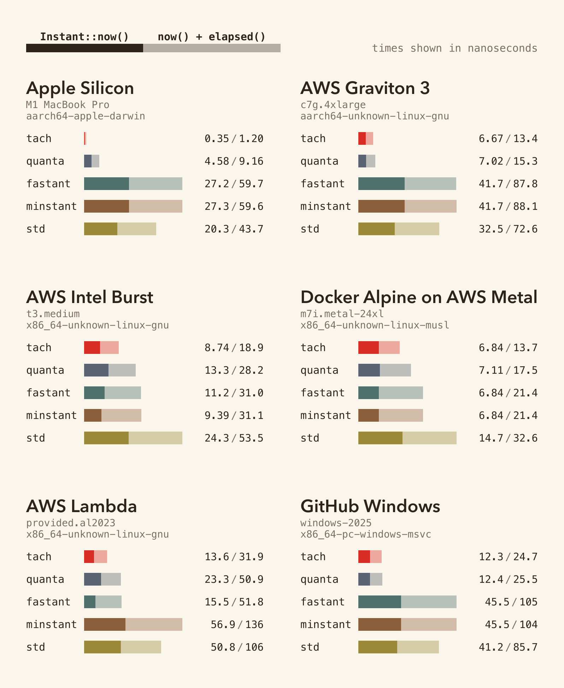

# tach

A replacement for `std::time::Instant` that reads the architectural counter directly: RDTSC on x86, CNTVCT_EL0 on aarch64, rdtime on riscv64 / loongarch64.

[](https://docs.rs/tach)
[](https://crates.io/crates/tach)

## usage

```rust
use tach::Instant;

let start = Instant::now();
// ...work...
let elapsed = start.elapsed();
```

`tach::Instant` is a drop-in replacement for `std::time::Instant`: same surface (`now`, `elapsed`, `duration_since`, `checked_*`, arithmetic with `Duration`). On supported targets it compiles to a single counter instruction; on unsupported architectures it falls back to the platform monotonic clock (`clock_gettime`, `mach_absolute_time`, `QueryPerformanceCounter`, or `Performance.now()` on wasm).

## benchmark



Methodology and per-target reports: [BENCHMARKS.md](BENCHMARKS.md).

## semantics

The counter is wall-clock-rate. It keeps ticking through park, suspension, and descheduling. All threads in the process read the same source. It is **not** strictly cross-thread monotonic: raw hardware counters can disagree across CPUs by sub-microsecond sync slop, and by larger margins on AMD Zen4 (CCX boundary effects). If that matters, use `std::time::Instant`, which the kernel coerces into per-thread monotonicity at the cost of ~20 ns per call.

## ordered reads

A plain counter read can be reordered earlier than a preceding `Acquire` load:

```rust
let deadline = scheduler.load(Ordering::Acquire);
let now = tach::Instant::now();   // may be sampled before `deadline` is observed
```

`mrs cntvct_el0` is a system-register read; `rdtsc` is not a serializing instruction. Memory fences don't constrain when either executes. `OrderedInstant` emits the per-arch barrier (`isb sy` on aarch64, `lfence` on x86) before the counter read, restoring the order:

```rust
let deadline = scheduler.load(Ordering::Acquire);
let now = tach::OrderedInstant::now();   // sampled after `deadline`
```

Cost is ~5–20 ns more than `Instant::now()`. `OrderedInstant::as_unordered()` downgrades to a plain `Instant` for storage; the reverse is not provided.

On riscv64 (`fence iorw, iorw`) and loongarch64 (`dbar 0`) the strongest available memory barrier is used; whether memory fences constrain CSR reads is implementation-defined on those targets, so the guarantee is best-effort.

## platform support

| Platform / target               | `Instant` clock                  |
|---------------------------------|----------------------------------|
| Linux (x86_64)                  | RDTSC                            |
| Linux (x86)                     | RDTSC                            |
| Linux (aarch64)                 | CNTVCT_EL0                       |
| Linux (riscv64)                 | rdtime                           |
| Linux (loongarch64)             | rdtime.d                         |
| macOS (aarch64)                 | CNTVCT_EL0                       |
| macOS (x86_64)                  | RDTSC                            |
| Windows (x86_64)                | RDTSC                            |
| Windows (aarch64)               | CNTVCT_EL0                       |
| wasm32 (browser / Node host)    | `Performance.now()`              |
| WASI (wasm32-wasip{1,2})        | `clock_time_get(MONOTONIC)`      |
| Unix / other                    | `clock_gettime(CLOCK_MONOTONIC)` |

The crate is `#![no_std]`. `wasm-bindgen` is the only dependency, pulled in only for `wasm32-unknown-unknown` and `wasm32v1-none` (the targets that go through `Performance.now()`).

## non-goals

- Strict cross-thread monotonicity. Use `std::time::Instant`.
- Clock-skew correction across machines. This is a per-process counter.

## msrv

Rust 1.85.

## license

MIT OR Apache-2.0.
