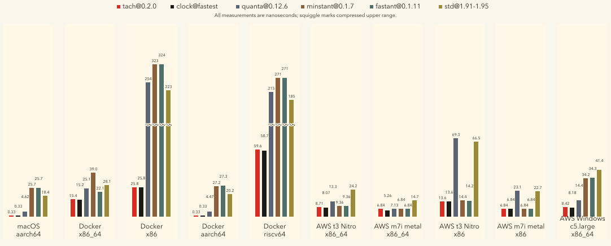

# hotclock

`hotclock` is an ultra-fast drop-in replacement for `Instant` designed for hot loops, profiling and benchmarks.

Internally, it mirrors [cpucycles](https://cpucycles.cr.yp.to), so whether you're running
in a container, a VM or on bare metal, it automatically selects the fastest machine-level timer at runtime.

## performance



Full target/environment results: [runtime selection validation](benches/runtime-selection-validation-2026-05-08.md).

Runtime selection is the point. The same `x86_64-linux-musl` binary selected
`RDTSC` for `Cycles` inside an AWS t3 KVM VM and `perf-RDPMC` on AWS m7i bare
metal, then patched warmed call sites to the selected clock.

Fresh validation runs below were produced with
`tools/selection-validation-runner` on May 8, 2026. `ok` means the selected
`Instant` and `Cycles` clocks matched the expected fastest valid clocks for that
target/environment.

| Environment        | Target              | Instant clock | Cycles clock     | Instant | Cycles | quanta | minstant | fastant | std    | ok |
|--------------------|---------------------|---------------|------------------|--------:|-------:|-------:|---------:|--------:|-------:|----|
| AWS t3 KVM         | x86_64-linux-musl   | x86_64-rdtsc  | x86_64-rdtsc     | 8.711ns | 8.066ns | 13.254ns | 9.356ns | 9.356ns | 24.249ns | ✅ |
| AWS m7i metal      | x86_64-linux-musl   | x86_64-rdtsc  | x86_64-perf-rdpmc | 6.841ns | 5.262ns | 7.130ns | 6.841ns | 6.841ns | 14.734ns | ✅ |
| AWS t3 KVM         | x86-linux-musl      | x86-rdtsc     | x86-rdtsc        | 13.552ns | 13.551ns | 69.312ns | 14.363ns | 14.154ns | 66.458ns | ✅ |
| AWS m7i metal      | x86-linux-musl      | x86-rdtsc     | x86-rdtsc        | 6.841ns | 6.841ns | 23.066ns | 6.841ns | 6.841ns | 22.743ns | ✅ |
| Docker amd64       | x86_64-linux-gnu    | x86_64-rdtsc  | x86_64-rdtsc     | 15.394ns | 15.222ns | 25.079ns | 39.050ns | 22.066ns | 28.070ns | ✅ |
| Docker 386         | x86-linux-gnu       | x86-rdtsc     | x86-rdtsc        | 25.789ns | 25.780ns | 253.702ns | 323.398ns | 324.264ns | 222.623ns | ✅ |
| Docker arm64       | aarch64-linux-gnu   | aarch64-cntvct | aarch64-cntvct  | 0.330ns | 0.330ns | 4.466ns | 27.203ns | 27.275ns | 20.222ns | ✅ |
| Docker riscv64     | riscv64-linux-gnu   | riscv64-rdtime | riscv64-rdcycle | 59.584ns | 58.656ns | 215.296ns | 271.262ns | 271.241ns | 185.151ns | ✅ |

## feature comparison

| Feature                 | `hotclock` | `tick_counter@0.4.5` | `quanta@0.12.6` | `minstant@0.1.7` | `std::time` |
|-------------------------|------------|----------------------|-----------------|------------------|-------------|
| `Instant` API           | ✅         | ❌                   | ✅              | ✅               | ✅          |
| runtime clock selection | ✅         | ❌                   | ✅              | ✅               | ❌          |
| CPU tick access         | ✅         | ✅                   | ✅              | ❌               | ❌          |
| zero dependency         | ✅         | ✅                   | ❌              | ❌               | ✅          |

## usage

```rust
use hotclock::Instant;

let start = Instant::now();
// ... work ...
let elapsed = start.elapsed_ticks();

println!("{} us", elapsed.as_micros());
println!("using {} @ {} Hz", Instant::implementation(), Instant::frequency());
```

## `Instant` vs `Cycles`

`Instant` is the safe elapsed-time clock. It uses the fastest counter that stays
monotonic across OS thread migration and cross-thread handoffs. Use it for
deadlines, budgets, runtime scheduling, cross-thread timestamps, and measurements
that must survive descheduling, suspend/resume, or VM movement.

`Cycles` is the lower-level hot-loop clock contract. It is an `Instant`-shaped
counter for taking a sample, taking another sample, and subtracting them, but it
can use faster machine counters such as RDPMC, PMCCNTR_EL0, rdcycle, or the
fastest equivalent source for the target. It does not carry `Instant`'s
cross-thread or OS-thread-event guarantees. Use it for same-thread
microbenchmarks, profilers, tight polling loops, and short measurements where
clock read cost dominates.

## platform / architecture support

For common modern systems, hotclock uses a direct counter where the target has
one clear path and uses runtime selection when the hardware counter can vary
by machine, kernel, or hypervisor.

Runtime selection is thread-safe on the first racing call. Selected targets with
crate-owned patchpoints rewrite warmed `Instant` and `Cycles` call sites to the
chosen counter or fallback trampoline, so later reads do not keep selected-index
dispatch on the hot path.

Rows with multiple clocks are runtime-selected. Rows with one clock compile to
that direct clock or direct fallback.

| Platform / target       | `Instant` clocks          | `Cycles` clocks                         | Selection |
|-------------------------|---------------------------|-----------------------------------------|-----------|
| macOS (aarch64)         | CNTVCT_EL0                | CNTVCT_EL0                              | direct |
| macOS (x86/x86_64)      | RDTSC, mach               | RDTSC, mach                             | runtime |
| Windows (x86/x86_64)    | RDTSC, std                | RDTSC, std                              | runtime |
| Windows (aarch64)       | CNTVCT_EL0, std           | CNTVCT_EL0, std                         | runtime |
| Linux (x86_64)          | RDTSC, clock_gettime      | RDPMC, perf-RDPMC, RDTSC, clock_gettime | runtime + patch |
| Linux (x86)             | RDTSC, clock_gettime      | RDPMC, perf-RDPMC, RDTSC, clock_gettime | runtime + patch |
| Linux (aarch64)         | CNTVCT_EL0, clock_gettime | PMCCNTR_EL0, CNTVCT_EL0, clock_gettime  | runtime + patch |
| Unix/other (aarch64)    | CNTVCT_EL0, clock_gettime | CNTVCT_EL0, clock_gettime               | runtime + patch |
| Unix/other (riscv64)    | rdtime, clock_gettime     | rdcycle, rdtime, clock_gettime          | runtime + patch |
| Linux (loongarch64)     | rdtime.d, clock_gettime   | rdtime.d, clock_gettime                 | runtime + patch |
| Linux (s390x)           | clock_gettime             | clock_gettime                           | direct fallback |
| Unix/other (powerpc64)  | OS timer                  | OS timer                                | direct fallback |
| other                   | OS timer                  | OS timer                                | direct fallback |

## changelog

### 0.2.0

- `Instant` API compatability
- skip selection for known fast hardware counters
- thread-safe `OnceLock` timer selection
- overflow-safe unit conversions

### 0.1.0

- initial release with CPU/platform tick counters, wall-time conversions, CLI diagnostics, examples, and Criterion benchmarks
