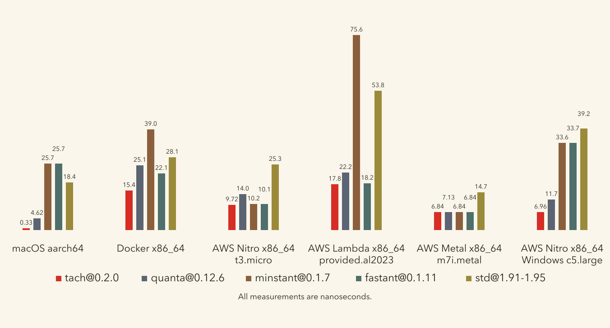
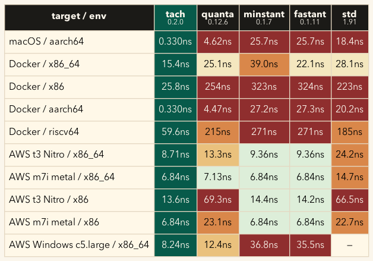

# tach

`tach` is an ultra-fast drop-in replacement for `Instant` designed for hot loops, profiling and benchmarks.

Each supported target compiles `Instant::now()` directly to the fastest wall-clock-rate hardware counter for that architecture — RDTSC on x86_64, CNTVCT_EL0 on aarch64, rdtime on riscv64/loongarch64 — and falls back to a platform-native monotonic clock everywhere else. No runtime dispatch, no microbenchmark at startup, no patching tricks for `Instant`.

For users who want to measure **actual CPU cycles consumed** (profilers, cryptographic micro-benchmarks, regression detection in CI), `tach` exposes a separate `Cycles` API backed by the CPU's performance monitor counter. `Cycles` is gated by host OS permission and returns `None` rather than silently substituting a wall-clock-rate counter when PMU access is denied.

## performance






The primary benchmark is `Instant::now()` read cost across target/environment pairs. The fastest measured `Instant`-compatible clock is the first bar, and its name appears in parentheses under each target. Bars use one shared broken scale; squiggles mark the compressed upper range for Docker outliers.

## feature comparison

| Feature                          | `tach` | `tick_counter@0.4.5` | `quanta@0.12.6` | `minstant@0.1.7` | `std::time` |
|----------------------------------|--------|----------------------|-----------------|------------------|-------------|
| `Instant`-compatible API         | ✅     | ❌                   | ✅              | ✅               | ✅          |
| Inlined hardware counter         | ✅     | ✅                   | partial         | partial          | ❌          |
| CPU cycle counter (`Cycles`)     | ✅ (gated) | ❌               | ❌              | ❌               | ❌          |
| Documented cross-thread semantics | ✅    | ❌                   | partial         | ❌               | ✅          |
| Zero dependency                  | ✅     | ✅                   | ❌              | ❌               | ✅          |

## usage

```rust
use tach::Instant;

let start = Instant::now();
// ... work ...
let elapsed = start.elapsed_ticks();

println!("{} us", elapsed.as_micros());
println!("using {} @ {} Hz", Instant::implementation(), Instant::frequency());
```

## `Instant` vs `Cycles` — two distinct measurement primitives

These are **different kinds of counter at the hardware level**, not two performance tiers on the same counter. Picking the right one for the right job matters.

### `Instant` — wall-clock-rate timer

Backed by **RDTSC / CNTVCT_EL0 / rdtime**. These count at a fixed architectural rate (the nominal CPU base frequency on invariant TSC; ~24 MHz on Graviton and Apple Silicon; platform timer rate on RISC-V).

- **Thread-state independent.** Keeps ticking during park/unpark, priority changes, descheduling, deep-sleep wake. The same number of ticks elapse per nanosecond whether your thread was scheduled or not.
- **Same source for every thread** in the process. All threads read from the same counter.
- **NOT strictly cross-thread monotonic.** Raw hardware counters can disagree across CPUs by sub-microsecond sync slop on most hosts, and by larger margins on AMD Zen4 (CCX boundary effects). If your code requires that thread B's read be ≥ thread A's read with strict monotonicity, use `std::time::Instant` — its kernel-mediated vDSO bookkeeping enforces monotonicity at the cost of ~20–25 ns per call. tach's `Instant` is fast precisely because it does not pay that cost.

Use `Instant` for: timeouts, deadlines, latency measurements, request budgets — anywhere you want fast wall-clock time and aren't relying on strict cross-thread ordering for correctness.

### `Cycles` — true CPU cycle counter

Backed by **RDPMC fixed cycle counter / PMCCNTR_EL0 / rdcycle**. These count actual CPU cycles executed by the current core.

- **Counts CPU work, not wall time.** Stops during park, sleep, idle, halt.
- **Scales with frequency.** A P-state change to a higher clock makes the counter tick faster; this is observable as throttling.
- **Per-core, never synchronized** across cores. If a thread migrates mid-measurement, the counter jumps by an arbitrary amount.
- **Gated by host OS permission.** Requires `/sys/bus/event_source/devices/cpu/rdpmc ≥ 2` on x86_64-linux, `/proc/sys/kernel/perf_user_access = 1` on aarch64-linux. `Cycles::now()` returns `None` when access is denied — it never silently substitutes a wall-clock-rate counter.

Use `Cycles` for: profilers, cryptographic micro-benchmarks (cpucycles-style), JIT hotspot accounting, perf-aware CI — wherever you specifically want to count work performed by the CPU and have control over the deployment host's PMU permissions.

## platform / architecture support

| Platform / target       | `Instant` clock      | `Cycles` clock                              | Fallback                  |
|-------------------------|----------------------|---------------------------------------------|---------------------------|
| macOS (aarch64)         | CNTVCT_EL0           | n/a — no user-mode PMU                      | —                         |
| macOS (x86_64)          | RDTSC                | n/a — no user-mode RDPMC                    | mach_absolute_time        |
| Windows (x86_64)        | RDTSC                | n/a — no user-mode PMU                      | QueryPerformanceCounter   |
| Windows (aarch64)       | CNTVCT_EL0           | n/a — no user-mode PMU                      | QueryPerformanceCounter   |
| Linux (x86_64)          | RDTSC                | RDPMC fixed / perf-RDPMC if permitted       | clock_gettime             |
| Linux (x86)             | RDTSC                | RDPMC fixed / perf-RDPMC if permitted       | clock_gettime             |
| Linux (aarch64)         | CNTVCT_EL0           | PMCCNTR_EL0 / perf-PMCCNTR if permitted     | clock_gettime             |
| Unix/other (aarch64)    | CNTVCT_EL0           | n/a                                         | clock_gettime             |
| Unix (riscv64)          | rdtime               | rdcycle if user CSR access enabled          | clock_gettime             |
| Linux (loongarch64)     | rdtime.d             | n/a — no user PMU                           | clock_gettime             |
| Linux (s390x)           | clock_gettime        | n/a                                         | clock_gettime             |
| other                   | OS timer             | n/a                                         | OS timer                  |

`Instant::now()` compiles directly to the listed hardware counter on every supported target — no runtime dispatch, no patchpoints, same inline performance as the raw instruction.

`Cycles::now()` checks PMU permission on first call and, on hosts that grant access, commits the choice via a self-modifying patchpoint so subsequent reads have the same inline performance as a raw `rdpmc` / `mrs pmccntr_el0` / `rdcycle`. On hosts where permission is denied, `Cycles::now()` returns `None`.

## design rationale

The May-9 falsification matrix in [`benches/selection-falsification-2026-05-09.md`](benches/selection-falsification-2026-05-09.md) measured 25 (target × environment) cells across AWS bare-metal, virtualized, Lambda, GitHub-hosted runners, macOS, Windows, and Docker. The data drove two decisions:

1. **No runtime selection for `Instant`.** Every measured cell of every supported target picked the same wall-clock-rate counter. Selection's multi-candidate latency comparison adds startup cost and code complexity without ever changing the winner on any measured host.
2. **`Cycles` as a separate API with PMU-permission gating.** The original `Cycles` implementation conflated true cycle counting with wall-clock-rate counting (falling back to RDTSC when PMU was denied). Splitting the two and returning `None` when PMU is unavailable is honest about what the API delivers.

The deletion was a net 4,000+ LOC reduction; the simpler design honors the same four user-facing promises (fastest target-appropriate clock, inline performance, never crash/segfault/spawn, safe cross-thread use under each API's documented semantic).

## changelog

### 0.2.0

- Direct hardware counter inlined per supported target (RDTSC / CNTVCT_EL0 / rdtime).
- `Cycles` API for true CPU-cycle counting, gated behind host OS permission.
- Honest documented cross-thread semantics (same source for every thread, thread-state independent; not strictly cross-thread monotonic — see `std::time::Instant` for that guarantee).
- Overflow-safe unit conversions.

### 0.1.0

- Initial release with CPU/platform tick counters, wall-time conversions, CLI diagnostics, examples, and Criterion benchmarks.
