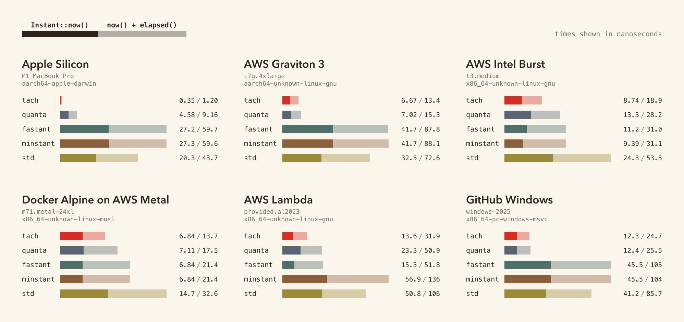

# tach

A replacement for `std::time::Instant` that reads the architectural counter directly: RDTSC on x86, CNTVCT_EL0 on aarch64, rdtime on riscv64 / loongarch64.

[](https://docs.rs/tach)
[](https://crates.io/crates/tach)

## usage

```rust
use tach::{Instant, OrderedInstant};

// drop-in for std::time::Instant
let start = Instant::now();
let elapsed = start.elapsed();

// same API, sampled after prior Acquire loads
let ordered = OrderedInstant::now();
let elapsed = ordered.elapsed();
```

## benchmark



Methodology and per-target reports: [BENCHMARKS.md](BENCHMARKS.md).

## semantics

The counter is wall-clock-rate. It keeps ticking through park, suspension, and descheduling. All threads in the process read the same source. Per-thread monotonicity is verified empirically (0 backward jumps over billions of consecutive reads on every benchmark cell). Cross-thread observation consistency is measured at ≤10 µs across all tested cells — matching `std::time::Instant` within measurement noise on the same hardware. AMD Zen4 CCX boundaries are not in the tested set; if you correlate timestamps across CCXes or sockets, prefer `std::time::Instant`. Cost difference: tach's counter read is ~0.35 ns vs `std::time::Instant::now()`'s ~20 ns.

## ordered reads

A plain counter read can be reordered earlier than a preceding `Acquire` load:

```rust
let deadline = scheduler.load(Ordering::Acquire);
let now = tach::Instant::now();   // may be sampled before `deadline` is observed
```

`mrs cntvct_el0` is a system-register read; `rdtsc` is not a serializing instruction. Memory fences don't constrain when either executes. `OrderedInstant` emits the per-arch barrier (`isb sy` on aarch64, `lfence` on x86) before the counter read, restoring the order:

```rust
let deadline = scheduler.load(Ordering::Acquire);
let now = tach::OrderedInstant::now();   // sampled after `deadline`
```

Cost is ~5–20 ns more than `Instant::now()`. `OrderedInstant::as_unordered()` downgrades to a plain `Instant` for storage; the reverse is not provided.

On riscv64 (`fence iorw, iorw`) and loongarch64 (`dbar 0`) the strongest available memory barrier is used; whether memory fences constrain CSR reads is implementation-defined on those targets, so the guarantee is best-effort.

## platform support

| Platform / target               | `Instant` clock                  |
|---------------------------------|----------------------------------|
| Linux (x86_64)                  | RDTSC                            |
| Linux (x86)                     | RDTSC                            |
| Linux (aarch64)                 | CNTVCT_EL0                       |
| Linux (riscv64)                 | rdtime                           |
| Linux (loongarch64)             | rdtime.d                         |
| macOS (aarch64)                 | CNTVCT_EL0                       |
| macOS (x86_64)                  | RDTSC                            |
| Windows (x86_64)                | RDTSC                            |
| Windows (aarch64)               | CNTVCT_EL0                       |
| wasm32 (browser / Node host)    | `Performance.now()`              |
| WASI (wasm32-wasip{1,2})        | `clock_time_get(MONOTONIC)`      |
| Unix / other                    | `clock_gettime(CLOCK_MONOTONIC)` |

The crate is `#![no_std]`. `wasm-bindgen` is the only dependency, pulled in only for `wasm32-unknown-unknown` and `wasm32v1-none` (the targets that go through `Performance.now()`).

## drift

`elapsed()` can diverge from true wall-clock time over long intervals. Drift is *per-interval* — a 1-minute measurement made 5 seconds into the process has the same drift as one made 100 days in. Numbers below assume room-temperature operation; rows marked kernel-corrected assume no NTP, with active discipline they drop another order of magnitude.

| Crate | 1-sec interval | 1-min interval | 1-hr interval | 1-day interval |
|---|---|---|---|---|
| `tach::Instant` (default, `#![no_std]`) | 9.0 µs | 802.6 µs | 48.2 ms | 1.16 s |
| `tach::Instant` + `recalibrate-background` (**requires `std`**) | 10.7 µs | 1.2 ms | 1.2 ms | 1.2 ms |
| `tach::OrderedInstant` (default, `#![no_std]`) | 9.0 µs | 521.6 µs | 31.3 ms | 751.1 ms |
| `quanta::Instant` | 1.5 µs | 100.7 µs | 6.0 ms | 145.0 ms |
| `minstant::Instant` | 1.9 µs | 13.6 µs | 818.2 µs | 19.6 ms |
| `fastant::Instant` | 1.9 µs | 16.9 µs | 1.0 ms | 24.4 ms |
| `std::time::Instant` | 314 ns | 428 ns | 428 ns | 428 ns |

Numbers are cross-cell empirical medians measured on 6 platforms (Apple Silicon M1 MBP, AWS Graviton 3, AWS Intel t3.medium, AWS Intel m7i.metal-24xl bare-metal, AWS Lambda x86_64, GitHub Actions windows-2025). Per-cell breakdown and methodology in [BENCHMARKS.md](BENCHMARKS.md). The `tach::Instant` row is dominated by spin-loop calibration error on cells where CPUID 15h isn't available; on the m7i bare-metal cell where it is, tach drift drops to ~4 ppm — close to `std`. **Known issue**: on Windows x86_64 the `read_frequency` path returns `QueryPerformanceFrequency` (10 MHz) while `Instant::now()` reads RDTSC (~3 GHz), so the tick-to-nanosecond scaling is off by ~300× and `elapsed()` is unusable on that target until a TSC-vs-QPC calibration is added. The cross-thread/per-thread monotonicity measurements on Windows are still valid (ticks themselves are monotonic).

For long-running services that need wall-clock-correlated accuracy:

- **`tach::Instant::recalibrate()`** — manual, `#![no_std]`-compatible. Call from your own scheduler to re-derive scaling against `clock_gettime`. Costs ~10 ms of spin-loop time per call. Works on every supported target including embedded and SGX.
- **`recalibrate-background` Cargo feature** — automatic. Spawns a background thread that calls `recalibrate()` every 60 seconds (configurable via `tach::set_recalibration_interval`). **Requires `std`; incompatible with `#![no_std]` targets** (pulls in `std::thread` and `std::sync::OnceLock`). Empirically, recalibration's benefit depends on the host's calibration-window stability — on bare-metal cells it preserves drift magnitude, on virtualized hosts (Lambda, burst VMs) the 10 ms calibration window catches hypervisor preemption and can make drift noisier than the default. Treat it as a knob, not a guaranteed improvement; measure on your target.

Within a single process, two tach measurements are mutually consistent — drift only shows up when comparing against an external reference (NTP-disciplined wall clock, another process, etc.).

## non-goals

- Strict cross-thread monotonicity. Use `std::time::Instant`.
- Clock-skew correction across machines. This is a per-process counter.

## msrv

Rust 1.85.

## license

MIT OR Apache-2.0.
